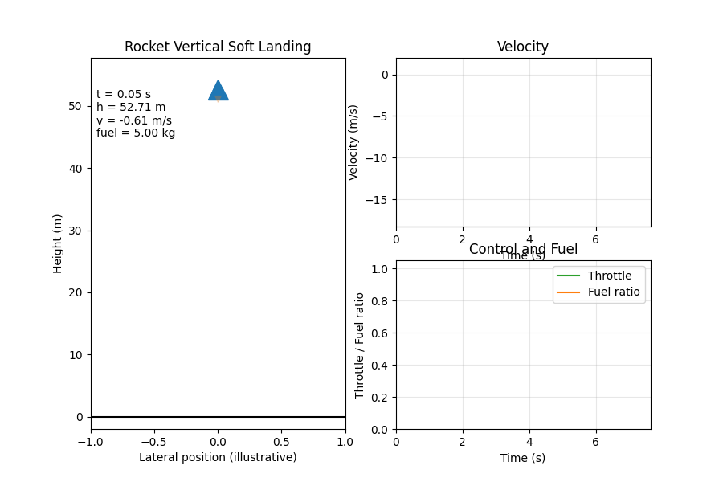

# DRL Rocket Landing Control

[](https://github.com/17362975180/drl-rocket-landing-control/actions/workflows/ci.yml)
[](LICENSE)
[](requirements.txt)
[](rocket_landing_control/envs/rocket_env.py)

Energy-aware deep reinforcement learning project for one-dimensional vertical
rocket soft landing. The flagship result is a pure Energy-Guided PPO controller
that lands faster, uses less fuel, and reaches lower touchdown velocity than the
Standard PPO baseline.



## Why This Project Is Interesting

- Pure Energy-Guided PPO is the main method: the policy observes energy ratios
  and is trained with an energy-shaped objective.
- Standard PPO is kept as the baseline, not the headline.
- Physics constraints are explicit: fuel depletion, thrust lag, drag, mass
  changes, action delay, sensor noise, and safety shielding.
- The repository compares Energy PPO against Standard PPO, PID, MPC,
  event-triggered MPC, SAC, and TD3 instead of showing only one successful run.

## Project Status

This repository is prepared for public release as a compact research/code
artifact. It includes runnable source code, the Energy PPO checkpoint, selected
verified summaries, the final course-submission snapshot, and a
reproducibility report. Large regenerated experiment folders and local scratch
files are intentionally excluded from version control.

## Highlights

- Gymnasium environments for rocket dynamics, fuel limits, thrust inertia, drag,
  and safety constraints.
- Pure Energy-Guided PPO training and evaluation workflow.
- Standard PPO baseline retained for direct comparison.
- Evaluation scripts for 100-episode standard tests and 11-scenario robustness
  / generalization tests.
- Baseline comparisons against PID, MPC, event-triggered MPC, SAC, and TD3.
- Lightweight verified summaries are kept in the repository; large generated
  experiment artifacts are intentionally excluded from Git.

## Key Results

Representative verified results from the public Energy PPO artifacts:

| Evaluation | Result |
| --- | --- |
| Main method | Pure Energy-Guided PPO |
| Standard 100-episode eval | 100% success, 0.299 m/s mean final velocity error |
| Efficiency vs Standard PPO | Fuel use 3.015 kg vs 4.406 kg; landing time 4.716 s vs 7.293 s |
| Unified 11-scenario protocol | 99.8% average success; worst scenario 98% |
| Main public checkpoint | `results/reproducible/energy_ppo_from_scratch_time/models/pure_energy_ppo_model.zip` |

For the full experimental narrative, see
`docs/reports/REPORT_REPRODUCIBLE.md` and
`results/reproducible/VERIFIED_RESULTS.md`.

## Repository Layout

```text
.
|-- configs/                      # PPO configuration files
|-- docs/                         # Roadmap, release notes, structure guide
|   `-- reports/                  # Long-form experiment reports
|-- experiments/                  # Experiment entry points
|-- rocket_landing_control/       # Source package and runnable modules
|   |-- core/                     # Shared evaluation and reproducibility helpers
|   |-- envs/                     # Rocket landing environments
|   |-- studies/                  # Ablations, robustness, and controller comparisons
|   |-- visualization/            # Plotting, animation, and figure generation
|   `-- workflows/                # Training, evaluation, smoke tests, verification
|-- saved_models/                 # Legacy Standard PPO baseline checkpoint
|-- results/reproducible/         # Lightweight verified summaries
|-- scripts/                      # Repository maintenance helpers
|-- submission_version/           # Final course-submission snapshot and report
`-- requirements.txt
```

The local workspace may contain `tmp/`, `.venv/`, full `results/`, TensorBoard
logs, rendered documents, and large JSON trajectory dumps. These are ignored so
the GitHub repository stays clean and reproducible.

## Included Artifacts

The public repository keeps a lightweight set of artifacts:

- `results/reproducible/energy_ppo_from_scratch_time/models/pure_energy_ppo_model.zip`
- `results/reproducible/energy_ppo_from_scratch_time/models/pure_energy_vec_normalize.pkl`
- `results/reproducible/energy_ppo_from_scratch_time/baseline_vs_pure_energy_ppo.json`
- `results/reproducible/energy_ppo_from_scratch_time/baseline_vs_pure_energy_metrics.png`
- `results/reproducible/energy_ppo_from_scratch_time/baseline_vs_pure_energy_trajectory.png`
- `results/reproducible/energy_ppo_from_scratch_time/scenarios/standard_comparison/scenario_comparison.json`
- `results/reproducible/*.json`
- `results/reproducible/VERIFIED_RESULTS.md`
- `results/reproducible/landing_demo.gif`
- `submission_version/report/深度强化学习报告.pdf`
- `submission_version/report/深度强化学习报告.docx`

Full regenerated experiment folders are not tracked. Re-run the relevant
scripts to recreate them locally.

## Installation

Python 3.10 or 3.11 is recommended. PyTorch and Stable-Baselines3 compatibility
with Python 3.13 is not assumed.

Windows PowerShell:

```powershell
.\setup_env.ps1
.\.venv\Scripts\Activate.ps1
```

Cross-platform manual setup:

```bash
python -m venv .venv
source .venv/bin/activate  # Windows: .\.venv\Scripts\Activate.ps1
python -m pip install --upgrade pip
python -m pip install -r requirements.txt
```

## Quick Check

Run the fast smoke tests:

```bash
python -m rocket_landing_control.workflows.smoke_tests
```

Run a quick evaluation with the included Energy PPO checkpoint:

```bash
python -m rocket_landing_control.workflows.quick_eval \
  --env energy \
  --model results/reproducible/energy_ppo_from_scratch_time/models/pure_energy_ppo_model.zip \
  --stats results/reproducible/energy_ppo_from_scratch_time/models/pure_energy_vec_normalize.pkl \
  --n-episodes 10
```

The full reproducibility verifier checks generated artifacts under `results/`.
It is meant for the complete local research workspace; a fresh GitHub clone only
contains lightweight summaries and will not include every generated figure,
training run, and trajectory file. After regenerating or restoring the full
result artifacts, run:

```bash
python -m rocket_landing_control.workflows.verify_reproducible_outputs
```

## Training

Train a pure Energy-Guided PPO landing controller:

```bash
python -m rocket_landing_control.studies.energy_ppo_experiment \
  --output-dir results/local_energy_ppo \
  --train-steps 300000 \
  --n-episodes 100 \
  --seed 17000
```

Run a formal 100-episode Energy PPO evaluation:

```bash
python -m rocket_landing_control.workflows.quick_eval \
  --env energy \
  --model results/reproducible/energy_ppo_from_scratch_time/models/pure_energy_ppo_model.zip \
  --stats results/reproducible/energy_ppo_from_scratch_time/models/pure_energy_vec_normalize.pkl \
  --n-episodes 100 \
  --seed 17000 \
  --output results/local_eval/energy_ppo_eval.json
```

## Reproducibility Notes

Verified summary artifacts:

- `results/reproducible/VERIFIED_RESULTS.md`
- `results/reproducible/verified_summary.json`
- `results/reproducible/landing_demo.gif`
- `docs/reports/REPORT_REPRODUCIBLE.md`

Large generated outputs are excluded from version control. Re-run the scripts
above to regenerate local artifacts under `results/`.

## Report

The final course report is stored in:

- `submission_version/report/深度强化学习报告.pdf`
- `submission_version/report/深度强化学习报告.docx`

## AI Usage

AI-assisted development and review notes are documented in
`docs/AI_USAGE.md`.

## Structure

The repository structure is documented in `docs/STRUCTURE.md`. The short
version: public-facing documentation lives in `docs/`, source code lives in
`rocket_landing_control/`, experiment orchestration lives in `experiments/`, and
the root stays reserved for project metadata and high-level folders.

## Roadmap

Planned improvements are tracked in `docs/ROADMAP.md`. The most useful next
upgrades are packaging the environment as an installable Gymnasium environment,
adding a notebook tutorial, and publishing richer benchmark tables.

## Release Notes

The release preparation checklist and GitHub publishing commands are documented
in `docs/OPEN_SOURCE_RELEASE.md`.

## License

This project is released under the MIT License. See `LICENSE` for details.
